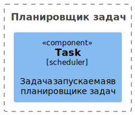
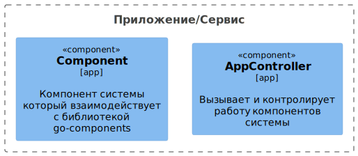
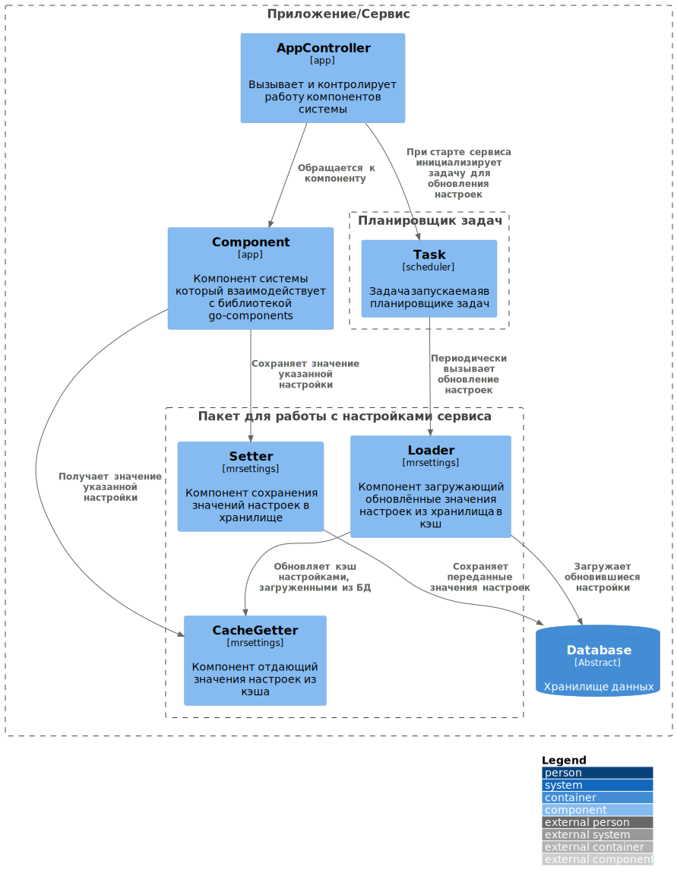

# Описание GoComponents v0.7.6
Этот репозиторий содержит описание библиотеки GoComponents.

## Статус библиотеки
Библиотека находится в стадии разработки.

## Описание библиотеки
Библиотека содержит набор компонентов повторного использования:
- компонент для доступа к произвольным настройкам: чтение, запись, а также с использованием кэша;
- компонент упорядочивания записей на основе двусвязного списка,
  позволяет встраиваться в произвольные таблицы БД;

## Подключение библиотеки
`go get -u github.com/mondegor/go-components@v0.7.6`

## Установка библиотеки для её локальной разработки

- Выбрать рабочую директорию, где должна быть расположена библиотека
- `mkdir go-components && cd go-components` // создать и перейти в директорию проекта
- `git clone git@github.com:mondegor/go-components.git .`
- `cp .env.dist .env`

### Консольные команды используемые при разработке библиотеки

> Перед запуском консольных скриптов сервиса необходимо скачать и установить утилиту Mrcmd.\
> Инструкция по её установке находится [здесь](https://github.com/mondegor/mrcmd#readme)

- `mrcmd go help` - выводит список всех доступных go команд (docker версия);
- `mrcmd go-dev help` // выводит список всех доступных go-dev команд (локальная версия);
- `mrcmd go-dev fmt` // исправляет форматирование кода (gofumpt -l -w -extra ./)
- `mrcmd go-dev goimports-fix` // исправление imports, если это требуется (goimports -d -local ${GO_DEV_LOCAL_PACKAGE} ./)
- `mrcmd go-dev check` // статический анализ кода библиотеки (линтеры: govet, staticcheck, errcheck)
- `mrcmd go-dev test` // запуск тестов библиотеки
- `mrcmd golangci-lint check` // запуск линтеров для проверки кода (на основе `.golangci.yaml`)
- `mrcmd plantuml build-all` // генерирует файлы изображений из `.puml` [подробнее](https://github.com/mondegor/mrcmd-plugins/blob/master/plantuml/README.md#%D1%80%D0%B0%D0%B1%D0%BE%D1%82%D0%B0-%D1%81-%D0%B4%D0%BE%D0%BA%D1%83%D0%BC%D0%B5%D0%BD%D1%82%D0%B0%D1%86%D0%B8%D0%B5%D0%B9-%D0%BF%D1%80%D0%BE%D0%B5%D0%BA%D1%82%D0%B0-markdown--plantuml)

## Примеры архитектуры системы с использованием библиотеки go-components

### Пакет mrsettings
- [CacheGetter + Loader](https://github.com/mondegor/go-components/blob/master/mrsettings/component/cachegetter/cache_getter.go)
- [Setter](https://github.com/mondegor/go-components/blob/master/mrsettings/component/setter/component_setter.go)

### Подсистема планировки задач
- [Scheduler](https://github.com/mondegor/go-webcore/blob/master/mrworker/mrschedule/scheduler.go)
- [Task](https://github.com/mondegor/go-webcore/blob/master/mrworker/mrschedule/task_shell.go)

### Сервис использующий пакет mrsettings
- [Фабрика пакета mrsettings](https://github.com/mondegor/go-sample/blob/master/app/cmd/factory/settings_manager.go)
- [Подключение пакета mrsettings](https://github.com/mondegor/go-sample/blob/bffd398fbc8cb7d3a3a8c521dc4d2babed0061ae/app/cmd/factory/app_environment.go#L137-L143)

### Верхнеуровневая архитектура
