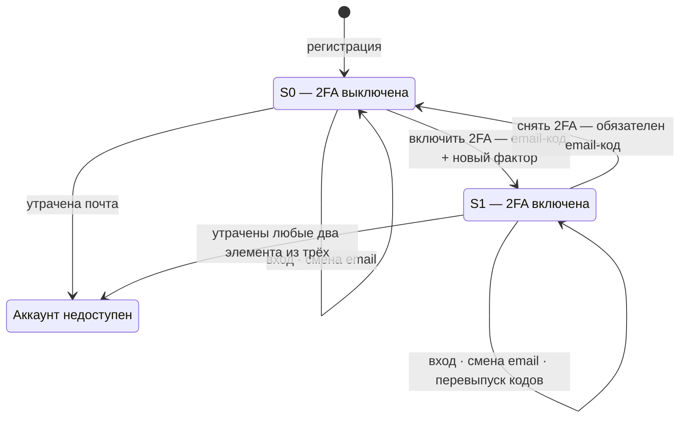

# Спецификация 2FA: вход, управление, восстановление

## Предпосылки

Действующая схема аутентификации одноуровневая: единственное доказательство — код, отправленный на email. Отсюда два следствия: потеря доступа к почтовому ящику означает безвозвратную потерю аккаунта, компрометация ящика — полный захват.

Вводится 2FA: второй независимый фактор — пароль **или** TOTP, ровно один из двух, — и список аварийных кодов как страховка, в том числе от потери самой почты.

---

## Модель

### Доказательства

| Доказательство | Тип                  | Доступно                    |
|----------------|----------------------|-----------------------------|
| Код на email   | владение ящиком      | всегда                      |
| Пароль         | знание               | если выбран вторым фактором |
| TOTP           | владение устройством | если выбран вторым фактором |
| Аварийный код  | одноразовое владение | после включения 2FA         |

### Состояния аккаунта

- **S0** — 2FA выключена. Вход по email-коду.
- **S1** — 2FA включена. Email + ровно один из {пароль, TOTP} + список аварийных кодов.

### Комбинации доказательств при S1

Существует три действительные комбинации:

```
email-код   + пароль/TOTP
пароль/TOTP + аварийный код
email-код   + аварийный код
```

За одну операцию тратится не более одного аварийного кода. Вход и последующая операция раздела 3 — две независимые проверки: если аварийный код предъявлен в обеих, расходуется два кода.

**Вход принимает все три комбинации. Операции над настройками безопасности — не все.**

| Операция                           | email-код + пароль/TOTP | пароль/TOTP + аварийный код | email-код + аварийный код |
|------------------------------------|:-----------------------:|:---------------------------:|:-------------------------:|
| Вход                               |           да            |             да              |            да             |
| Снять 2FA (3.1)                    |           да            |           **нет**           |            да             |
| Сменить email (3.2)                |           да            |             да              |          **нет**          |
| Перевыпустить аварийные коды (3.4) |           да            |           **нет**           |          **нет**          |

Правило, из которого получены эти ограничения: **операция требует предъявить те элементы, от которых аккаунт будет зависеть после неё.** Разбор — в 6.2.1.

### Step-up

Активная сессия не даёт права менять настройки безопасности. Каждая операция раздела 3 требует заново предъявить действующую комбинацию. Результат step-up действителен в пределах срока жизни последнего звена подтверждения: звена пароля/TOTP либо аварийного кода — по умолчанию 30 минут, звена email-кода — срок, заданный приложением (по умолчанию 10 минут); срок любого звена не больше 30 минут. Единственное исключение — завершение начатой смены адреса (3.2, п. 4): она уже оплачена step-up при создании токена и повторного не требует.

Все операции применяются немедленно после успешного step-up. Единственная операция, ожидающая подтверждения, — смена адреса: она ждёт кода с нового адреса (3.2) и применяется мгновенно в момент его ввода. Периодов ожидания, накладываемых системой поверх действий пользователя, в схеме нет.

---

## Диаграмма состояний аккаунта



Аккаунт имеет два рабочих состояния. Третье, «Аккаунт недоступен», системой не отслеживается и не хранится: это положение, в котором владелец больше не может собрать необходимое число доказательств. Обратного перехода из него нет.

### Переходы

| Переход   | Чем подтверждается                                                                                                          | Что меняется                                              |
|-----------|-----------------------------------------------------------------------------------------------------------------------------|-----------------------------------------------------------|
| S0 → S1   | email-код, затем подтверждение нового фактора                                                                               | появляется второй фактор, выдаётся список аварийных кодов |
| S1 → S0   | `email-код + пароль/TOTP` либо `email-код + аварийный код`                                                                  | второй фактор и аварийные коды уничтожаются               |
| S0 → S0   | email-код                                                                                                                   | вход; смена адреса (порог в S0 равен единице)             |
| S1 → S1   | вход — любая из трёх комбинаций; смена адреса — обязателен пароль/TOTP; перевыпуск кодов — только `email-код + пароль/TOTP` | смена адреса либо новый список аварийных кодов            |
| S0 → LOST | —                                                                                                                           | утрата почты, единственного доказательства                |
| S1 → LOST | —                                                                                                                           | утрата любых двух элементов из трёх (6.2)                 |

### Смена второго фактора на диаграмме

Отдельного перехода нет. Любое изменение второго фактора — и типа, и значения — это путь **S1 → S0 → S1** (3.3). На этом пути аккаунт проходит через S0, где защищён одной лишь почтой, и через переход S0 → S1, выдающий новый список аварийных кодов взамен уничтоженного.

### Порог доказательств по состояниям

В S0 множество доказательств состоит из одного элемента — почты, и порог равен единице: любая операция подтверждается email-кодом. В S1 элементов три, порог равен двум. Переход S0 → S1 поднимает порог, S1 → S0 опускает.

---

## 1. Вход

### S0

1. Ввод email.
2. Экран выбора доказательства — тот же, что в S1.
3. Выбор «Прислать код на почту», ввод кода из письма.
4. Сессия.

### S1

1. Ввод email.
2. Экран выбора: «Прислать код на почту» либо «У меня нет доступа к почте». Экран одинаков для всех аккаунтов, независимо от состояния 2FA и типа настроенного фактора.
3. Первое доказательство: код с почты либо — по второму варианту — пароль/TOTP-код.
4. Второе доказательство. После кода с почты принимается и пароль/TOTP-код, и аварийный код: вводятся они в одно и то же поле, выбирать заранее не нужно. После пароля/TOTP принимается только аварийный код.
5. Обе проверки пройдены → сессия.

Вариант «ввести пароль первым, а код с почты вторым» не поддерживается: новых комбинаций он не даёт, а порядок «сначала почта» позволяет не объявлять заранее, чем пользователь будет подтверждать второе звено.

До первого успешного доказательства интерфейс не показывает, включена ли у аккаунта 2FA: экран шага 2 одинаков для всех аккаунтов. Это удерживается и по варианту «нет доступа к почте». По нему сервер сразу сообщает тип второго фактора — пароль или TOTP, — чтобы интерфейс знал, что запросить; аккаунту без 2FA операция создаётся такая же, с подставным типом второго фактора, постоянным для этого аккаунта. Подтвердить её он не сможет, но и отличить от аккаунта с 2FA нельзя. Тип второго фактора аккаунта с 2FA по этому варианту, таким образом, виден до первого доказательства; скрыто лишь, включена ли 2FA.

Если выбранный вариант не соответствует настройкам аккаунта — пароль на TOTP-аккаунте, код из приложения на парольном, любой второй фактор в S0, — ответ неотличим от неверного значения: то же сообщение, та же задержка, тот же счётчик попыток.

Аварийный код, предъявленный на звене, где он не принимается (код с почты, пароль/TOTP первым звеном), распознаётся по формату и отклоняется отдельной ошибкой, попытку не расходует и не гасится. Решение принимается только по формату ввода, до чтения 2FA аккаунта, поэтому ответ одинаков в S0 и S1.

Между шагами живёт токен попытки входа: срок звена email-кода задаётся приложением (по умолчанию 10 минут), звена пароля/TOTP и аварийного кода — по умолчанию 30 минут, потолок любого звена — 30 минут; срок отсчитывается заново при переходе к каждому звену. Токен привязан к устройству, хранит оставшиеся звенья цепочки, меняется на каждом шаге, доступа к данным не даёт.

---

## 2. Включение 2FA (S0 → S1)

1. Пользователь в аккаунте нажимает «Включить 2FA» и выбирает второй фактор.
2. Step-up: код на email.
3. Настройка второго фактора:
   - **Пароль** — вводится дважды ещё до step-up, при выборе фактора: от 10 до 32 символов — латинские буквы, цифры и спецсимволы (любые печатные символы ASCII, кроме пробела), надёжность не ниже порога, заданного приложением (по умолчанию STRONG), не в формате аварийного кода. После step-up пароль устанавливается.
   - **TOTP** — после step-up показывается секрет и QR-код, пользователь вводит текущий код из приложения. Без подтверждения кодом фактор не активируется.
4. Выдача 10 аварийных кодов: показ один раз, кнопки «Скачать» и «Скопировать».
5. На том же экране предупреждение: коды показываются один раз; хранить их в почте нельзя; при потере доступа к почте, второму фактору и кодам одновременно аккаунт восстановить невозможно.
6. 2FA активна. Уведомление на email. Все незавершённые операции пользователя — в том числе начатые вход и смена адреса (3.2) — отзываются: их цепочки подтверждения построены при прежнем состоянии 2FA; адрес не меняется. Открытые сессии не затрагиваются (раздел 5).

---

## 3. Операции в аккаунте

### 3.1 Снять 2FA (S1 → S0)

Принимаются только комбинации, содержащие **email-код**: `email-код + пароль/TOTP` либо `email-код + аварийный код`. Комбинация `пароль/TOTP + аварийный код` отклоняется. Применяется сразу.

1. Step-up.
2. Экран подтверждения: вход снова только по почте, потеря почты означает потерю аккаунта.
3. 2FA выключается, аварийные коды аннулируются. Все незавершённые операции пользователя — в том числе начатые вход и смена адреса (3.2) — отзываются; адрес не меняется. Открытые сессии не затрагиваются (раздел 5).
4. На email уходит уведомление: 2FA отключена, дата и время, IP и устройство. Ссылок, выполняющих какое-либо действие, в письме нет.

Текст уведомления содержит инструкцию на случай, если операцию выполнял не владелец: войти в аккаунт и включить 2FA заново, выбрав второй фактор; проверить безопасность почтового ящика. Выполнение инструкции требует полноценного входа, то есть двух доказательств.

### 3.2 Сменить email

В S1 принимаются только комбинации, содержащие **пароль или TOTP**: `email-код + пароль/TOTP` либо `пароль/TOTP + аварийный код`. Комбинация `email-код + аварийный код` отклоняется. В S0 доказательство одно — email-код, им операция и подтверждается.

1. Step-up.
2. Ввод нового адреса. Создаётся **токен смены адреса**: хранит прежний и новый адреса. Срок жизни токена задаётся приложением: длинный срок отсчитывается от создания токена и переотправкой кода не продлевается, короткий продлевается при каждой переотправке кода, как у прочих операций. Пока токен не подтверждён, адрес аккаунта остаётся прежним. Одновременно у аккаунта может существовать только один такой токен; создание нового закрывает предыдущий.
3. На новый адрес отправляется код подтверждения: действует в пределах жизни токена, переотправляется в её пределах по лимитам операции (раздел 5). Ввод кода закрывает токен и меняет адрес. Все прочие незавершённые операции пользователя отзываются: их коды подтверждения и уведомления привязаны к прежнему адресу. Открытые сессии не затрагиваются.
4. Код вводится в той же сессии, где создан токен, либо в новой — после полноценного входа в аккаунт. Повторный step-up не требуется: он уже оплачен при создании токена. Знание одного лишь кода, без сессии, смену не завершает.
5. Токен можно отозвать в любой момент до подтверждения — из интерфейса аккаунта, где он виден вместе со сроком истечения. По истечении срока жизни токен закрывается сам, адрес не меняется.
6. Уведомления. На прежний адрес — при создании токена (запрошена смена адреса, дата и время, IP и устройство, срок действия токена) и при завершении смены. На новый адрес — код подтверждения. Ссылок, выполняющих какое-либо действие, в письмах нет.
7. Запрос, завершение и отзыв смены адреса записываются в журнал безопасности аккаунта (раздел 5).

### 3.3 Сменить второй фактор

Отдельной операции нет. Это относится к любому изменению второго фактора: и к смене типа (пароль ↔ TOTP), и к смене значения при том же типе (новый пароль, новый TOTP-секрет на новом устройстве). Выполняется одним циклом: снять 2FA (3.1) → включить заново (раздел 2).

Сброса пароля по ссылке из письма не существует.

- Между снятием и повторным включением аккаунт находится в S0 и защищён только почтой.
- Экран, завершающий снятие 2FA, сразу предлагает включить её заново с выбором фактора. В интерфейсе это один непрерывный сценарий, а не две операции в разных разделах настроек.
- Старый список аварийных кодов аннулируется при снятии, новый выдаётся при включении. Пользователь должен сохранить новый список. Предупреждение об этом показывается до начала цикла.
- Прежний второй фактор при снятии уничтожается, а не откладывается: хеш пароля или TOTP-секрет удаляются немедленно. Вернуть его нельзя, можно только настроить фактор заново.

### 3.4 Перевыпустить аварийные коды

Принимается единственная комбинация — `email-код + пароль/TOTP`. Любая комбинация, включающая аварийный код, отклоняется. Применяется сразу.

1. Step-up.
2. Генерируется новый список из 10 кодов, все старые аннулируются немедленно. Показ один раз, с тем же предупреждением, что в п. 2.5.
3. На email уходит уведомление: список аварийных кодов перевыпущен, дата и время, IP и устройство. Ссылок, выполняющих какое-либо действие, в письме нет.

В интерфейсе постоянно отображается число оставшихся кодов; при остатке не выше порога, заданного приложением (по умолчанию 3), показывается баннер. На каждую трату кода на email уходит уведомление с указанием остатка; если остаток не выше порога, в письмо добавляется предложение перевыпустить список.

---

## 4. Сценарии потери

### 4.1 Потерян доступ к почте

**2FA включена:**

1. Вход: `пароль/TOTP + аварийный код`.
2. Смена email (3.2): создаётся токен, код уходит на новый адрес, ввод кода завершает смену. Эта комбинация для смены адреса разрешена.
3. Перевыпуск аварийных кодов — уже новой парой `email-код + пароль/TOTP`.

Снятие 2FA до смены адреса недоступно: оно требует email-код, которого у пользователя нет (6.2.1).

**2FA выключена:** аккаунт потерян.

### 4.2 Забыт пароль

1. Вход: `email-код + аварийный код`.
2. Снятие 2FA (3.1).
3. Включение 2FA заново с новым паролем (раздел 2). Старый пароль нигде не требуется.
4. Сохранение нового списка аварийных кодов.

### 4.3 Потерян доступ к TOTP

1. Вход: `email-код + аварийный код`.
2. Снятие 2FA (3.1).
3. Включение 2FA заново — либо TOTP на новом устройстве, либо пароль (раздел 2).
4. Сохранение нового списка аварийных кодов.

### 4.4 Потерян список аварийных кодов

Вход `email-код + пароль/TOTP`, затем перевыпуск (3.4). Старые коды аннулируются. Второй фактор при этом не меняется.

### 4.5 Аварийные коды закончились

Остаётся единственная комбинация `email-код + пароль/TOTP`. Предупреждение показывается заранее, при остатке не выше порога (3.4).

### 4.6 Потеряны почта и второй фактор, почта и коды, либо второй фактор и коды

Аккаунт потерян. Ручного восстановления через поддержку нет.

---

## 5. Технические требования

**Email-код:** только цифры, длина задаётся приложением (от 4 до 8), срок — срок звена (по умолчанию 10 минут), одноразовый. Попытки ввода и повторные отправки считаются на операцию: по умолчанию до 3 попыток, до 3 повторных отправок не чаще 1 раза в 2 минуты; повторная отправка возвращает полный запас попыток. Не более 5 отправок в час на аккаунт.

**TOTP:** RFC 6238, SHA-1, 6 цифр, шаг 30 секунд, окно приёма ±1 шаг. Номер последнего использованного шага сохраняется, повторное предъявление отклоняется. Секрет нужен для проверки кода, поэтому хешированию не подлежит и сейчас хранится в базе как есть. Требование, которое ещё предстоит выполнить: хранить его зашифрованным, ключ шифрования — вне базы данных.

**Пароль:** bcrypt (стоимость по умолчанию), от 10 до 32 символов — латинские буквы, цифры и спецсимволы (любые печатные символы ASCII, кроме пробела), надёжность не ниже порога, заданного приложением (по умолчанию STRONG), не в формате аварийного кода, без принудительной ротации.

**Аварийные коды:** по умолчанию 10 штук, 17 символов из латиницы и цифр (`A–Z0–9`) с разделителем `-` посередине, то есть 16 случайных символов — около 82 бит энтропии; хранятся хешированными тем же алгоритмом, что и пароль, одноразовые, гасятся атомарно. Код гасится в момент, когда комбинация принята целиком — при входе либо при step-up, — а не по завершении многошаговой операции: одним кодом нельзя оплатить два входа или два step-up, в том числе в течение жизни токена смены адреса. Совпадение этих двух моментов обеспечено структурно: аварийный код принимается только последним звеном цепочки подтверждений, поэтому предъявить его, не пройдя перед этим другое доказательство, невозможно. Отсюда же и то, что держатель одного лишь списка кодов не может сжечь ни одного (6.3). Если комбинация отклонена как недопустимая для запрошенной операции, код не расходуется: проверка допустимости комбинации выполняется до проверки самого кода.

**Ограничение частоты:** экспоненциальная задержка на неудачные попытки любого доказательства, счётчики раздельные по аккаунту и по IP.

- Временная блокировка после N неудач подряд действует на пару **(аккаунт, IP/устройство)**, а не на аккаунт целиком.
- Счётчик по аккаунту в целом добавляет только ограниченную сверху задержку ответа и никогда не закрывает вход с устройств, ранее успешно входивших в этот аккаунт.
- Уведомление на email отправляется при срабатывании блокировки.

**Сессии** операциями раздела 3 и включением 2FA не затрагиваются: текущая сессия сохраняется, прочие не завершаются. Пользователь видит список своих открытых сессий и может сам закрыть любую из них, например после смены второго фактора или адреса.

**Уведомления на email** на каждое событие: вход с нового устройства; трата аварийного кода с указанием остатка (при остатке не выше порога — с предложением перевыпустить, 3.4); включение и снятие 2FA; перевыпуск аварийных кодов; создание токена смены адреса и завершение смены (на оба адреса); блокировка после перебора.

**Журнал безопасности** в интерфейсе аккаунта: состоявшиеся события безопасности — вход, включение и снятие 2FA, трата аварийного кода, перевыпуск кодов, запрос, завершение и отзыв смены адреса, смена телефона, закрытие сессий, повторное использование токена обновления открытой сессии, блокировка после перебора. У каждого события — время, IP, устройство; смена адреса и телефона записывается с прежним и новым значением. Неудачные попытки по отдельности не записываются: их итог — событие блокировки. Пользователь удалить журнал не может; срок хранения задаёт приложение.

---

## 6. Обоснование надёжности

### 6.1 Сводная таблица операций

Все операции применяются немедленно после успешного ввода указанных доказательств.

| Операция                                 | Что нужно ввести                                                                                                                              |
|------------------------------------------|-----------------------------------------------------------------------------------------------------------------------------------------------|
| Вход, S0                                 | email-код                                                                                                                                     |
| Вход, S1                                 | `email-код + пароль/TOTP`, либо `пароль/TOTP + аварийный код`, либо `email-код + аварийный код`                                               |
| Включить 2FA                             | email-код, затем подтверждение нового фактора: пароль дважды либо код из TOTP-приложения                                                      |
| Снять 2FA                                | `email-код + пароль/TOTP` либо `email-код + аварийный код`                                                                                    |
| Сменить email, S1                        | `email-код + пароль/TOTP` либо `пароль/TOTP + аварийный код`, плюс код с нового адреса, введённый в сессии — в пределах срока жизни токена    |
| Сменить email, S0                        | email-код плюс код с нового адреса, введённый в сессии                                                                                        |
| Отозвать токен смены email               | активная сессия (токен виден в интерфейсе аккаунта)                                                                                           |
| Сменить второй фактор — тип или значение | отдельной операции нет: снятие 2FA, затем включение заново                                                                                    |
| Перевыпустить аварийные коды             | только `email-код + пароль/TOTP`                                                                                                              |

В таблице нет ни одной строки, где действие выполнялось бы переходом по ссылке из письма. Письма только уведомляют; всё, что меняет состояние аккаунта, требует двух доказательств на сайте.

Единственный срок, в течение которого начатая операция ждёт завершения, — срок жизни токена смены адреса (3.2), заданный приложением. Это не задержка применения: смена происходит сразу после ввода кода с нового адреса. Это предельное время, пока операция ждёт подтверждения и остаётся отзываемой. Прочие сроки в схеме (разделы 1, 3.2 и 5) — время жизни самих доказательств, токена попытки входа и step-up, а не ожидание применения.

### 6.2 Пороговое свойство

Каждая из трёх комбинаций входа состоит из двух разных элементов множества {почта, второй фактор, аварийные коды}, и все три пары этого множества покрыты. Отсюда два симметричных следствия.

**Для владельца.** Аккаунт переживает потерю любого одного элемента из трёх: две оставшиеся вещи образуют действующую комбинацию, через которую утраченный элемент восстанавливается — почта сменой адреса (3.2), второй фактор циклом снятия и повторного включения 2FA (3.3), аварийные коды перевыпуском (3.4). Потеря любых двух элементов безвозвратна: остаётся одно доказательство, а требуется два.

**Для атакующего.** Захват требует владения ровно двумя элементами из трёх. Ни один элемент в одиночку не даёт ни входа, ни какой-либо операции.

**Сравнение с исходным состоянием.** До внедрения 2FA множество состояло из одного элемента, порог был равен единице: потеря почты означала потерю аккаунта, компрометация почты — захват. После внедрения оба события требуют двух независимых элементов.

### 6.2.1 Выход из каждого сценария потери

Правило «операция требует предъявить те элементы, от которых аккаунт будет зависеть после неё» даёт ограничения раздела «Модель» так:

- после снятия 2FA аккаунт зависит только от почты — значит, обязателен email-код;
- при смене адреса почта заменяется, неизменным остаётся второй фактор — значит, обязателен пароль или TOTP;
- при перевыпуске заменяются аварийные коды, остаются почта и второй фактор — значит, обязательны оба.

Отсюда свойство: в каждом сценарии потери одного элемента **недоступна любая операция, которая привела бы к необратимой утрате аккаунта**, а операция, возвращающая утраченный элемент, доступна и требует ровно тех двух элементов, которые в этом сценарии уцелели.

| Утрачен элемент | Уцелели             | Разрешённая операция                              | Почему остальные закрыты                                         |
|-----------------|---------------------|---------------------------------------------------|------------------------------------------------------------------|
| Почта           | пароль/TOTP + коды  | сменить email (3.2)                               | снятие 2FA требует email-код; перевыпуск требует email-код       |
| Пароль или TOTP | почта + коды        | снять 2FA (3.1), затем включить заново (раздел 2) | смена адреса требует пароль/TOTP; перевыпуск требует пароль/TOTP |
| Аварийные коды  | почта + пароль/TOTP | перевыпустить коды (3.4)                          | остальные операции доступны, но не нужны                         |

Отсюда главное свойство схемы для владельца: **тупиковых состояний нет.** При потере любого одного элемента выход существует и очевиден, а операция, которая привела бы к необратимой потере аккаунта, в этом состоянии просто недоступна. Именно это закрывает ловушку, при которой пользователь без доступа к почте снимал бы 2FA и оказывался в S0 с ключом, которого у него нет.

### 6.3 Что даёт компрометация части элементов

Таблица описывает аккаунт в S1. В S0 множество состоит из одного элемента, порог равен единице, и владение почтовым ящиком даёт полный захват — устранение именно этого и есть цель включения 2FA.

| Что у атакующего              | Может войти | Может забрать аккаунт | Может лишить владельца доступа |
|-------------------------------|-------------|-----------------------|--------------------------------|
| Только адрес аккаунта         | нет         | нет                   | нет                            |
| Только почтовый ящик          | нет         | нет                   | нет                            |
| Только пароль или TOTP        | нет         | нет                   | нет                            |
| Только список аварийных кодов | нет         | нет                   | нет                            |
| Любые два элемента из трёх    | да          | да                    | да                             |

Владение одним элементом не даёт и **отказа в обслуживании**: в схеме нет ни одного действия, которое блокировало бы, замораживало или откатывало аккаунт по одному доказательству. Ограничение частоты исключением не является: блокировка после серии неудачных попыток действует на пару (аккаунт, IP/устройство) и на вход владельца с его устройств не распространяется (раздел 5), поэтому знание одного лишь адреса аккаунта не даёт и временного отказа в обслуживании. В частности, письма не содержат ссылок, выполняющих действие: захвативший почтовый ящик не может ни отменить чужую операцию, ни заморозить аккаунт, ни вернуть прежний адрес.

### 6.4 Принятая модель угроз

Схема исходит из допущения: **атакующий способен завладеть не более чем одним элементом одновременно.** При этом допущении успешное предъявление двух доказательств означает владельца, и никакая операция не нуждается в дополнительной проверке, отсрочке или подтверждении сверх step-up. Этим объясняется отсутствие в схеме отсрочек, накладываемых системой поверх действий пользователя, и особых правил для аварийных кодов: любое такое правило защищало бы от случая, который допущение исключает, и при этом мешало бы владельцу восстанавливать доступ. Ожидание подтверждения с нового адреса при смене email (3.2) отсрочкой не является: операция ждёт действия пользователя, а не истечения срока, и применяется в момент ввода кода.

Допущение поддерживается одним требованием к пользователю, вынесенным в интерфейс на экран выдачи кодов (п. 2.5 и 3.4): **аварийные коды нельзя хранить в почте.** Список кодов в почтовом ящике объединяет два элемента в один и опускает порог обратно до единицы, обесценивая всю схему.

**Чем являются и чем не являются ограничения на комбинации.** Правила из раздела «Модель», сужающие набор комбинаций для отдельных операций, защищают владельца от необратимой ошибки (6.2.1) и удерживают его от жизни на одних аварийных кодах (3.4). Дополнительной преградой против атакующего, уже владеющего двумя элементами, они не являются и не заявляются таковой: часть из них обходится последовательностью разрешённых шагов, и это нормально, поскольку два элемента по условию означают владельца. Конкретно:

- имея `email-код + аварийный код`, нельзя сменить адрес напрямую, но можно снять 2FA и сменить его уже в S0, где порог равен единице;
- имея `email-код + аварийный код`, нельзя перевыпустить список, но можно снять 2FA и включить её заново — при включении список выдаётся. Смысл запрета в 3.4 именно такой: список не выдаётся тому, кто не владеет обоими постоянными элементами прямо сейчас, и это удерживает пользователя от того, чтобы бессрочно жить на одних аварийных кодах, не восстановив утраченный фактор. Обойтись без второго фактора не выйдет и в обход: включение 2FA требует настроить фактор, то есть по завершении пользователь им владеет. Именно это, а не запрет как таковой, и обеспечивает дисциплину;
- имея `пароль/TOTP + аварийный код`, нельзя снять 2FA, но можно сменить адрес на свой и снять её после. Инвариант при этом не нарушается: снимает 2FA тот, кто действительно владеет действующей почтой аккаунта.

Если допущение нарушено и атакующий владеет двумя элементами, схема не обещает владельцу возврата контроля: атакующий располагает теми же правами, что и владелец, и в любой гонке за состояние аккаунта равен ему. Перечисленное ниже — **обнаружение и сужение окна**, а не гарантия:

- уведомление на email на каждое событие раздела 5, включая трату аварийного кода, — сигнал владельцу, что кодами воспользовался кто-то ещё;
- уведомление на прежний адрес в момент **создания** токена смены адреса, а не только по факту смены (3.2, п. 6): пока токен не подтверждён, адрес прежний, и владелец, читающий этот ящик, успевает войти и отозвать токен;
- отзыв токена смены адреса из интерфейса аккаунта в любой момент его жизни (3.2, п. 5). Гонку сам по себе отзыв не выигрывает: атакующий вправе создать токен заново;
- список открытых сессий в интерфейсе аккаунта и их закрытие вручную (раздел 5) — владелец может закрыть сессию атакующего, и наоборот; автоматически при изменении настроек безопасности сессии не завершаются;
- отзыв всех незавершённых операций при включении и снятии 2FA (раздел 2, 3.1) — в том числе чужого токена смены адреса;
- журнал безопасности, доступный пользователю и не удаляемый им (раздел 5).

Ни один из этих механизмов не срабатывает по одному доказательству. Письма содержат сведения, но не действия: ссылка вида «это был не я», отменяющая операцию по одному клику, в схему не вводится намеренно — она дала бы владельцу почтового ящика возможность откатывать чужие операции и замораживать аккаунт, то есть понизила бы порог до единицы для целого класса действий. Отзыв токена смены адреса устроен иначе и этой уязвимости не создаёт: он делается в аккаунте, вход в который требует двух доказательств.

---

## Приложение. Чек-лист приёмки

Для каждого пункта должен находиться ровно один непротиворечивый путь:

1. Вход в S0 и вход в S1 всеми тремя комбинациями.
2. Включение 2FA с паролем и включение 2FA с TOTP.
3. Снятие 2FA: уведомление с инструкцией уходит на email, прежний фактор и коды уничтожены, восстановление возможно только повторной настройкой.
4. Смена email: токен создан и виден в интерфейсе, письмо о его создании ушло на прежний адрес, код — на новый; проверить все три исхода токена — подтверждение, отзыв вручную, истечение срока жизни токена; проверить, что создание второго токена закрывает первый.
5. Смена второго фактора циклом «снять 2FA → включить заново» во всех четырёх вариантах: пароль → новый пароль, пароль → TOTP, TOTP → новый TOTP, TOTP → пароль. В каждом: непрерывность сценария в интерфейсе, аннулирование старого списка кодов и выдача нового.
6. Тот же цикл после входа с аварийным кодом (сценарии 4.2 и 4.3) проходит до конца.
7. Каждый сценарий раздела 4 доводится до рабочего состояния либо до явного «аккаунт потерян».
8. Каждая строка таблицы 6.3 воспроизводится и даёт заявленный результат.
9. В S1 ни одна операция не выполняется при одном предъявленном доказательстве, включая аварийный код в одиночку.
10. В S1 владение только почтовым ящиком не даёт отказа в обслуживании: ни одно письмо не содержит ссылки, которая блокирует, замораживает или откатывает состояние аккаунта.
11. Отклонение запрещённых комбинаций: снятие 2FA парой `пароль/TOTP + аварийный код`; смена адреса парой `email-код + аварийный код`; перевыпуск кодов любой парой, содержащей аварийный код. Во всех случаях аварийный код не должен гаситься.
12. Каждая строка таблицы 6.2.1 воспроизводится: при утрате одного элемента разрешённая операция проходит, а две другие отклоняются с понятным объяснением, что именно требуется предъявить.
13. Экран выбора доказательства идентичен для S0, S1-с-паролем и S1-с-TOTP; по ответам сервера — тексту, задержке, поведению счётчика — нельзя отличить S0 от S1 до успешного первого доказательства. По варианту «нет доступа к почте» аккаунт в S0 получает подставной тип второго фактора, постоянный для этого аккаунта.
14. Серия неудачных попыток с чужого IP не закрывает вход владельцу с его устройства; знание одного лишь адреса аккаунта не даёт временного отказа в обслуживании.
15. Один аварийный код нельзя израсходовать дважды: step-up для смены адреса гасит код сразу, второй step-up тем же кодом в пределах жизни токена смены адреса отклоняется.
16. Код на новый адрес действует и переотправляется в пределах жизни токена; ввод кода без сессии — по одному лишь знанию кода — смену не завершает.
17. При снятии и при включении 2FA отзываются все незавершённые операции пользователя, в том числе незакрытый токен смены адреса; адрес остаётся прежним.
18. При завершении смены адреса отзываются все прочие незавершённые операции пользователя; открытые сессии не затрагиваются.
