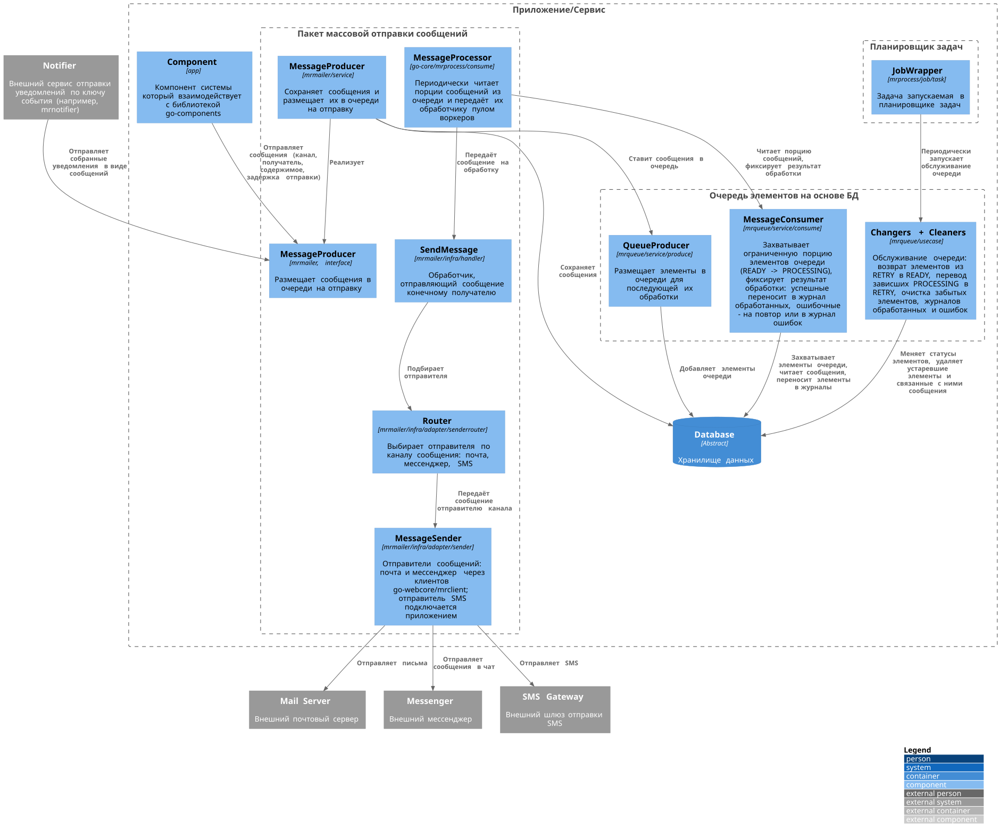

[Назад](../README.md)
---

# Пакет mrmailer
- [MessageProducer](mailer.go) - интерфейс постановки сообщений в очередь на отправку;
- [MessageProducer](service/message_producer.go) - сохраняет сообщения и ставит их в очередь на отправку;
- [SendMessage](infra/handler/message_sender.go) - обработчик, отправляющий сообщение получателю;
- [Router](infra/adapter/senderrouter/router.go) - выбирает отправителя по каналу сообщения;
- [Отправители сообщений](infra/adapter/sender);
- [Фабрики](../wire/mrmailer): producer, processor (обработка очереди), scheduler (обслуживание очереди);

## Верхнеуровневая архитектура

